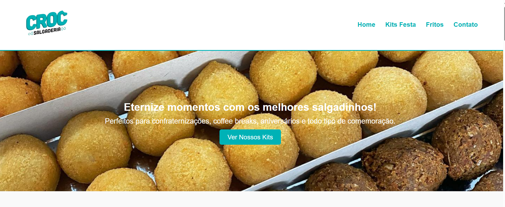

# Croc — Site de Salgadinhos e Kits Festa  
Projeto Integrador | SENAI — Desenvolvimento Front-End

## Acesse o site online  
https://lualexan0.github.io/Croc/

---

## Sobre o Projeto  
O **Croc** é um site desenvolvido como parte do Projeto Integrador do SENAI, no curso de Desenvolvimento Front-End.  
O objetivo principal foi atender uma necessidade real da comunidade: criar um site funcional para a divulgação de produtos, kits festa e facilitar o contato direto com a empresa Croc Salgadinhos.

O site foi construído com foco em clareza, praticidade e responsividade, apresentando os produtos de forma objetiva.  
Atualmente, o site está em uso real pela empresa.

---
## Prévia do Projeto  

### Página Inicial  

### Seção de Kits Festa  

## Objetivos do Projeto
- Criar presença digital para a empresa.  
- Facilitar o processo de pedidos e interação com clientes.  
- Exibir produtos e kits festa com preços e informações detalhadas.  
- Garantir uma navegação simples e responsiva.  
- Atender às demandas apresentadas no Projeto Integrador do SENAI.

---

## Tecnologias Utilizadas
- HTML5  
- CSS3  
- JavaScript (uso leve)  
- GitHub Pages (deploy e hospedagem)

---

## Funcionalidades
- Página inicial com área de destaque.  
- Apresentação dos Kits Festa com valores e composição.  
- Exibição de salgados fritos.  
- Botões de redirecionamento para WhatsApp para pedidos.  
- Layout totalmente responsivo.  
- Estrutura organizada e de fácil manutenção.

---

## Deploy  
O site está hospedado em **GitHub Pages**.  
Para atualizar, basta enviar as alterações para a branch `main`.

---

## Autora  
**Luana Alexandre da Silva**  
Desenvolvedora Front-End — SENAI  
Projeto desenvolvido como solução real para a comunidade.

